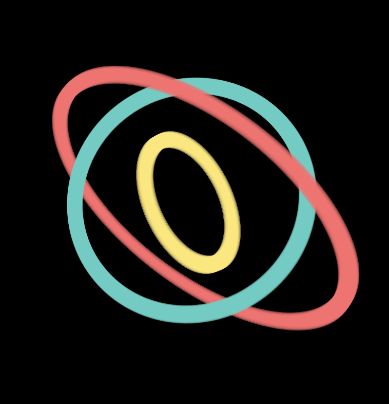

# ◎ Loop Time

Dynamic, responsive countdown rings with a 3D gyroscope-like finish.


## [→ View past timer](https://liamsimpkin.com/◎?start=2025-01-01T00:00:00+13:00&end=2025-01-01T12:00:00+13:00)

## Usage

Try it at `liamsimpkin.com/◎`

**Query Parameters** (ISO 8601 format):
- `?start=` — Countdown start time
- `?end=` — Countdown end time

**Example**:
```
liamsimpkin.com/◎?start=2025-11-24T21:22:15+13:00&end=2025-12-03T06:30:00+13:00
```


**How it works**: Three synchronized rings track overall progress (outer), hourly cycles (middle), and minute cycles (inner). When the countdown completes, the rings transform into a rotating 3D gyroscope.

<!--  -->